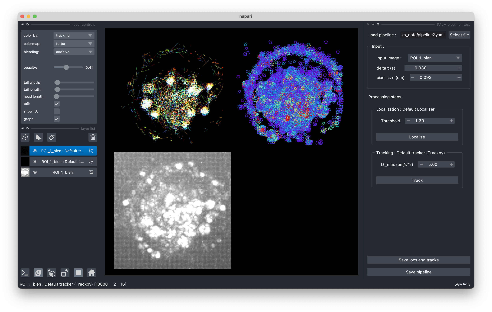

=============
Napari plugin
=============

One-off processing
------------------

Palmari also comes under the form of a Napari plugin. 
By default, it loads a standard pipeline, allowing to run the steps one by one, in order to see their effect and tweak their parameters.
You can thus use it to localize and track a single image, as it allows you to export the obtained localizations.

    Process your PALM movies with the default pipeline, or load your own !

Export and load pipelines
-------------------------

When parameters are well set, you can export the pipeline so as to use it later to analyse other images (for instance, using :py:func:`TifPipeline.from_yaml`).

If you've defined your :py:class:`TifPipeline` in a Python script or notebook, you can visualize its effect on an image using :py:func:`TifPipeline.open_in_napari`.

