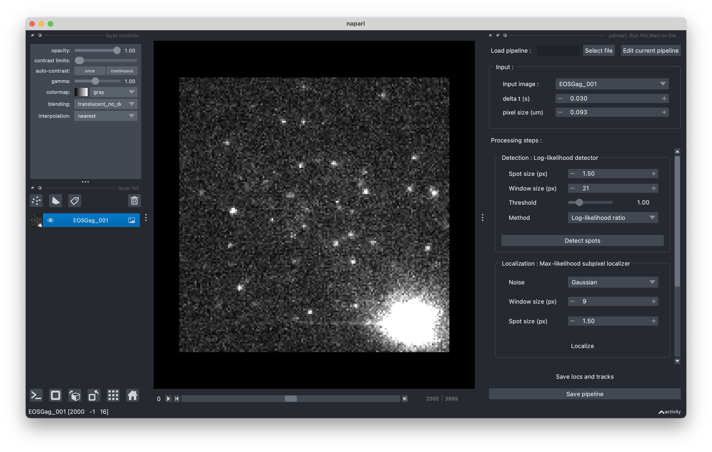
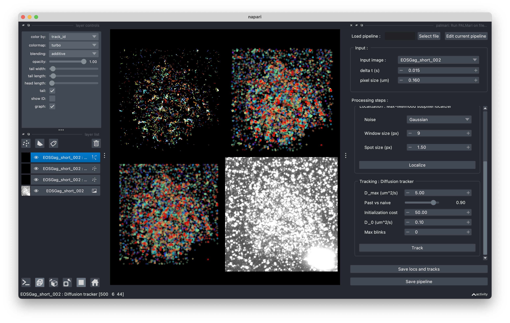
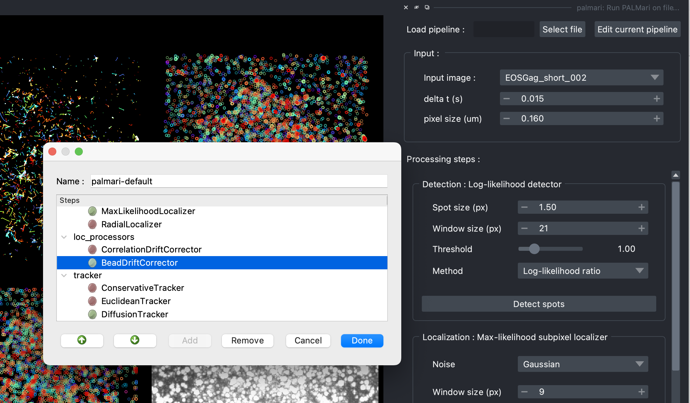
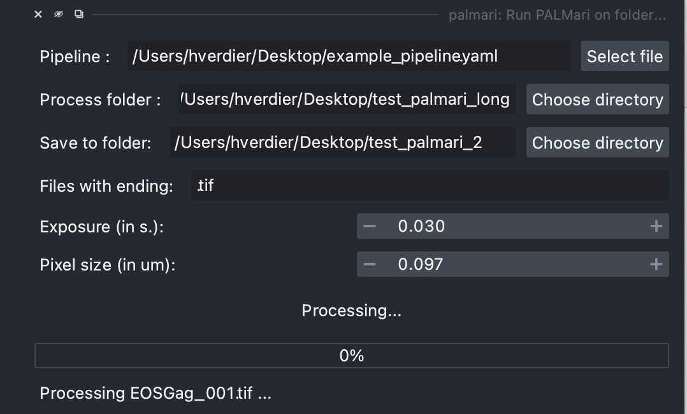

=============
Napari plugin
=============

Processing a single experiment
------------------------------

To process an microscope recording using Palmari, open Napari and click on ``Pulgins > palmari > Run Palmari on file...``.
The Napari panel appears (by default, on the right of your screen).

Do not forget, in the "Input" section, to enter the pixel size and exposition time of the recording !

    Palmari panel, with default pipeline.

A standard pipeline (i.e. succession of processing steps) is loaded, with the following steps:

- detection

- sub-pixel localization

- tracking

You can change the parameters of these steps and run them successively.

After processing, you can export the obtained localizations and tracks by clicking on the "save locs and tracks" button !

    Look at the intermediate steps using Napari's grid view.

Customizing the pipeline
------------------------

Do you want to add a drift correction step, or to use a different tracking algorithm ? 
Click on "Edit current pipeline" at the top of the panel, to change the steps.
See :ref:`here <image_pipeline>` for more information about the available processing steps.

    The pipeline edition window.

Export and load pipelines
-------------------------

You're satisfied with your pipeline and want to save it for later ? Export it by clicking on the "Save pipeline" button. 
It will create a ``.yaml`` file at a location of your choice. 
To load en existing pipeline, click on the "Load pipeline / select file" button at the top of the Palmari panel.

Process Batches of experiments
------------------------------

If you have a series of experiments to process, click on ``Plugins > palmari > run palmari on folder...``

A panel opens on the right. First, select the desired pipeline's ``.yaml`` file. 
Then, choose the location of your experiments and the folder where to export them.

Click on "Process files" and you're all set ! The progress bar will keep you informed of the processing, which might last for several hours, depending on the size of your files.

    Process all acquisitions in a folder, directly from Napari.

Loading pipelines with Python
-----------------------------

You can also load pipelines programatically using Palmari's Python interface, with :py:func:`ImagePipeline.from_yaml`.

Conversely, if you've defined your :py:class:`ImagePipeline` in a Python script or notebook, you can visualize its effect on an image using :py:func:`ImagePipeline.open_in_napari()`.