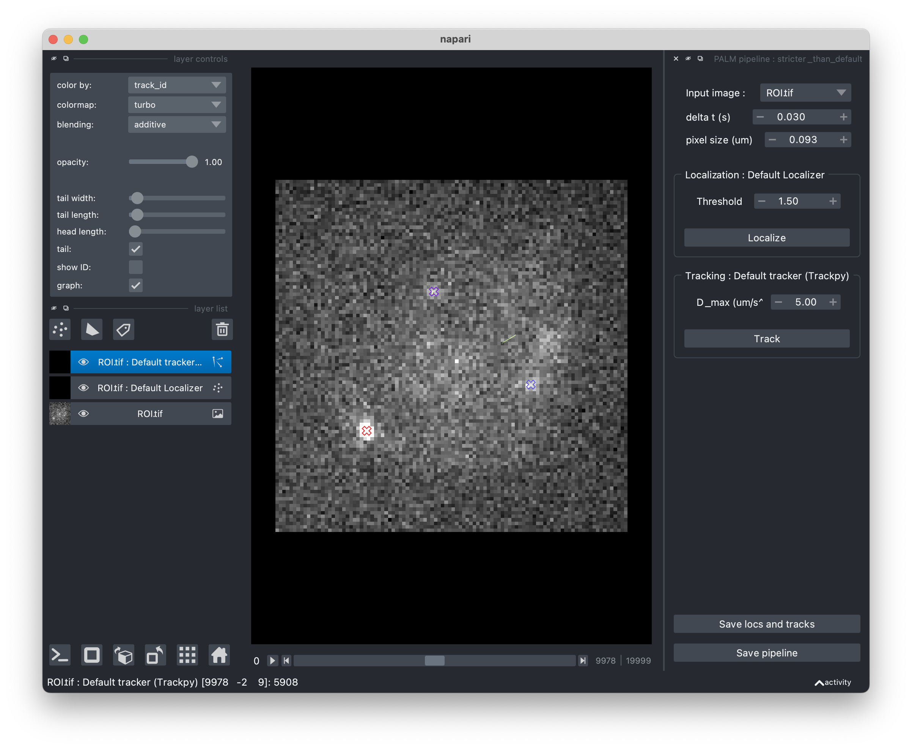

.. _tif_pipeline:

TIF processing pipeline
=======================

The ``TifPipeline`` class
-------------------------

Palmari provides a customizable pipeline structure for extracting localizations and tracks from PALM movies.
These steps are handled by the :py:class:`TifPipeline` class.

It is very easy to instanciate a default pipeline, containing only the minimal localization and tracking steps with default parameters :

.. code-block:: python3

    from palmari import TifPipeline

    tp = TifPipeline.default_with_name("my_pipeline")

A pipeline needs a name to export the localizations ot the movies it processes. 
Indeed, you might want to store localizations obtained using various pipelines applied on a same movie, 
in order to investigate the influence of the image processing step on your findings.

It takes just one line to run a pipeline on a movie or a batch of movies. 
The ``TifPipeline`` class uses `Dask <https://dask.org/>`_ 
to take advantage of multithreading when possible and limit the memory footprint of the processing.
By default, it will not re-process movies on which it has already been run. 

.. code-block:: python3

    tp.process(acq) # for a single acquisition
    # or
    tp.process(exp) # for all acquisitions of an experiment

Processing steps
----------------

Each step of the pipeline is an instance of a :py:class:`ProcessingStep` subclass and takes as input the output of its predecessor.
Steps are divided in four main categories :

1. Optionally, a few **movie pre-processors** (subclasses of ``MoviePreprocessor``). 
   Background removal or denoising steps fall into this category.
   These steps take as input a movie and output a modified movie. 

2. One **localizer** (subclass of ``Localizer``). 
   This step (maximum one per pipeline) takes as input the pre-processed movie and outputs a dataframe containing localizations.

3. Optionally, a few **localization** processors (subclasses of ``LocsProcessor``).
   These step modify localizations, add columns to the localizations table or discard localizations.  
   They take as input the localizations dataframe and output a modified dataframe.

4. One **tracker** (subclass of ``Tracker``).
   This step links consecutive localizations of one same particle, by adding an `n` column, correspondoing to the particle's ID, to the localizations dataframe. 
   It takes as input the localizations dataframe.

+-------+--------------------------+------------+-----------------------+------------------------------------+
| Order | Type of step             | Mandatory  | Multiple sub-steps ?  | Included                           |
+=======+==========================+============+=======================+====================================+
| 1     | Image processing         | ❌         |  ✅                   | :py:class:`WindowPercentileFilter` |
+-------+--------------------------+------------+-----------------------+------------------------------------+
| 2     | Localizer                | ✅         |  ❌                   | :py:class:`DefaultLocalizer`       |
+-------+--------------------------+------------+-----------------------+------------------------------------+
| 3     | Localizations processing | ❌         |  ✅                   | :py:class:`DriftCorrector`         |
+-------+--------------------------+------------+-----------------------+------------------------------------+
| 4     | Tracker                  | ✅         |  ❌                   | :py:class:`TrackpyTracker`         |
+-------+--------------------------+------------+-----------------------+------------------------------------+

In the table, "Mandatory" means that a pipeline must have one such step. On the contrary, non-mandatory steps can be omitted. 
If a pipeline does not mention any particular class/setting to use for a mandatory step, the default class for this step will be used, with default parameters.

Use built-in steps
------------------

Provided processing steps
^^^^^^^^^^^^^^^^^^^^^^^^^

PALM-tools comes with a few built-in processing steps, which you can use to compose yout processing pipeline. 

- :py:class:`WindowPercentileFilter` clips pixel values by considering the series of values in a time window and 
  using a given percentile as the minimum, setting all lower values of intensity to this minimal value.
  This is meant to remove background fluorescence. Parameters are :

    ``window_size`` : the size of the considered window, in number of frames

    ``percentile`` : the threshold percentage.

- :py:class:`DefaultLocalizer` detects localizations using a wavelet filter (see :ref:`ref<>`). 
  It then performs subpixel localization using radial symmetry, as described in :ref:`ref <https://www.nature.com/articles/nmeth.2071>`.
  It takes one single parameter :

    ``threshold_factor`` : determines the intensity threshold above which a peak in the signal is considered a localization, compared to the level of the background noise.
    1 is a reasonnable value, higher means stricter.

- :py:class:`DriftCorrector` corrects drift using time correlation between densities computed on time-wise binned localizations. 
  Densities are simply estimated using 2D histograms. 
  One drift vector is estimated per time bin, and the level of drift applied to each point is determined by interpolation.
  Parameters are :

    ``max_n_bins`` : maximum number of time bins.

    ``min_n_locs_per_bin`` : minimum number of localizations to form a time bin.

- :py:class:`TrackpyTracker` tracks localizations using the Trackpy package. 
  No missing localization is allowed (trajectories are cut if one point is missing).
  If there are two candidate localizations inside the search radius, the trajectory is cut as well.
  It takes one argument :

    ``max_diffusivity`` : estimation of the maximum diffusion coefficient, 
    which defines the maximum distance between two successive localizations (search radius) : \sqrt{4 D \Delta t}

Configure your pipeline
^^^^^^^^^^^^^^^^^^^^^^^

We recommend using the ``from_dict()`` class method to instanciate your pipelines, specifying the desired classes and parameters in a Python dictionnary. 
Steps must be grouped by categories using the ``movie_preprocessors``, ``localizer``, ``locs_processors`` and ``tracker`` keys. 
If no localizer or tracker is found, the default classes with default parameters are used.
If a class has no parameters, simply use an empty dictionnary as a value : ``{"MyStepWithoutArgs":{}}``.

.. code-block:: python3

    tp = TifPipeline.from_dict({
        "name":"default_with_percentile_filtering",
        "movie_preprocessors":[{"WindowPercentileFilter":{"percentile":10,"window_size":300}}]
    })

    tp = TifPipeline.from_dict({
        "name":"stricter_than_default",
        "localizer":{"DefaultLocalizer":{"threshold_factor":1.5}},
    )

Export your pipeline's configuration
^^^^^^^^^^^^^^^^^^^^^^^^^^^^^^^^^^^^

Pipelines can be exported and loaded from YAML files, so that they can easily be shared and re-used.

.. code-block:: python3

    tp.to_yaml("myproject/mypipeline.yaml") # Export
    tp = TifPipeline.from_yaml("myproject/mypipeline.yaml") # Load

The YAML file for the ``tp2`` pipeline is 

.. code-block:: yaml
    :caption: myproject/mypipeline.yaml

    localizer:
        DefaultLocalizer:
            threshold_factor: 1.5
    name: stricter_than_default
    tracker:
        TrackpyTracker:
            max_diffusivity: 5.0

Tune your pipeline with the Napari viewer
-----------------------------------------

If you would like to adjust your pipeline's parameters on one of your movies, you can use the :py:func:`TifPipelineWidget.view_pipeline` function. 
This will open a Napari viewer allowing you to see the effect of each step's parameters on the processing of your movie.
When you're satisfied, save the pipeline to a file by clicking the "Export pipeline" button ! 
You'll then be able to load it in a script or notebook using :py:func:`TifPipeline.from_yaml`.

.. code-block:: python3

    TifPipelineWidget.view_pipeline(acq=acq)
    # or
    TifPipelineWidget.view_pipeline(tif_file="ROI.tif")

.. _own_steps:

Make your own processing steps !
--------------------------------

Do you want to remove some background fluorescence prior to localizing ? 
To correct the drift or filter out some localizations ? 
To use the new state-of-the-art localizer instead of the rudimentary one provided by PALM-tools (inspired from ThunderSTORM's one) ?

**Good news** : the :py:class:`TifPipeline` class is actually quite customizable and open to add-ons ! 
If you want to use your own steps, subclass the corresponding abstract base class : 
for a localizer, :py:class:`Localizer`, for a movie pre-processor, :py:class:`MoviePreprocessor`, etc...

One method must be overriden in your subclass, whose name depends on the type of step, as summarized below.

+-------+--------------------------+------------+-------------------------------+---------------------------+----------------------+------------------------------------+
| Order | Type of step             | Mandatory  | Base class                    | Method to override        | Multiple sub-steps ? | Included                           |
+=======+==========================+============+===============================+===========================+======================+====================================+
| 1     | Image processing         | ❌         | :py:class:`MoviePreprocessor` | :py:func:`preprocess`     | ✅                   | :py:class:`WindowPercentileFilter` |
+-------+--------------------------+------------+-------------------------------+---------------------------+----------------------+------------------------------------+
| 2     | Localizer                | ✅         | :py:class:`Localizer`         | :py:func:`localize_slice` | ❌                   | :py:class:`DefaultLocalizer`       |
+-------+--------------------------+------------+-------------------------------+---------------------------+----------------------+------------------------------------+
| 3     | Localizations processing | ❌         | :py:class:`LocsProcessor`     | :py:func:`process`        | ✅                   | :py:class:`DriftCorrector`         |
+-------+--------------------------+------------+-------------------------------+---------------------------+----------------------+------------------------------------+
| 4     | Tracker                  | ✅         | :py:class:`Tracker`           | :py:func:`track`          | ❌                   | :py:class:`TrackpyTracker`         |
+-------+--------------------------+------------+-------------------------------+---------------------------+----------------------+------------------------------------+

.. important::

    Stick to the argument and output types provided in the abstract base classes for things to run smoothly. 
    Note that movie pre-processors' ``preprocess()`` functions expect Dask arrays while localizers' ``localize_slice()`` expect numpy arrays : 
    in this last case, Dask arrays are sliced by blocks of successive frames by the pipeline.

As an example, here is the code of default tracker class, based on `Trackpy <http://soft-matter.github.io/trackpy/v0.5.0/>`_. 
The source code of ``DefaultLocalizer`` and other built-in steps might guide you when implementing your own processing steps.

.. code-block:: python3

    class TrackpyTracker(Tracker):

        def __init__(self, max_diffusivity: float = 5.0):
            # Attributes will automatically be detected as parameters of the step and stored/loaded.
            # Parameters must have default values
            self.max_diffusivity = max_diffusivity

        def track(self, locs: pd.DataFrame):
            # This is where the actual tracking happen.
            import trackpy as tp

            delta_t = self.estimate_delta_t(locs) # This is a Tracker's method.
            dim = 2
            max_radius = np.sqrt(2 * dim * self.max_diffusivity * delta_t)
            logging.info("Max radius is %.2f" % max_radius)
            tracks = tp.link(locs, search_range=max_radius, link_strategy="drop")
            locs["n"] = tracks["particle"]
            return locs

        @property
        def name(self):
            # This is for printing
            return "Default tracker (Trackpy)"

        # The following dicts are used when setting the parameters through a graphic interface, using open_in_napari()
        widget_types = {
            "max_diffusivity": "FloatSpinBox", 
            "delta_t": "FloatSpinBox"
        }
        # For details about widget types, see https://napari.org/magicgui/
        widget_options = {
            "delta_t": {
                "step": 0.01,
                "tooltip": "time interval between frames (in seconds)",
                "min": 0.0,
                "label": "Time delta (s)",
            },
            "max_diffusivity": {
                "step": 1.0,
                "tooltip": "Assumed maximum diffusivity (in microns per square second).\nThis is used in conjunction with the Time delta to set the maximal distance between consecutive localizations",
                "label": "D_max (um/s^2)",
                "min": 0.0,
            },
        }